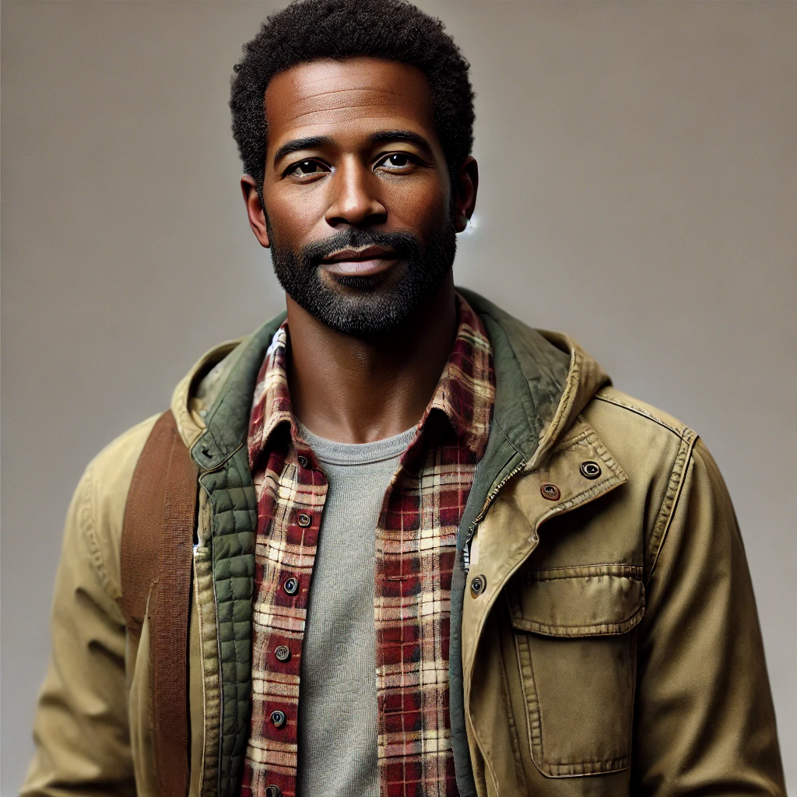

# **Stakeholders:**

**Advisors:**   
(Chris) Stakeholder because he is spending his time advising us on our work. The role he plays is giving us advice to help us tweak our project to best help people.

**Developers:**  
These are Alden, Kira, Kaitlyn, and Brady who are stakeholders because they are doing the work to create this project. The roles they play are developing and designing the project, as well as implementing it.

**Investors:**  
These can include anyone who invests funds to help create this project. Their roles are some advice or requirements to tweak the project towards their vision, as well as voting on the board.

**Users:**  
They are stakeholders because they are the ones actually using the project and want the project to be good and usable. Their roles are using the project, reporting bugs, and complaints, or suggestions to roll out in future updates.

**Blind Users:**   
They are stakeholders because they use the project and have a disability that can be accommodated by this project. Their roles are using the speech feature and reporting issues with it. 

**Colorblind Users:**   
They are stakeholders because they use the project and have a way they need to be accommodated. Their roles are testing the color changing features and suggesting potential changes to make the color options even more accommodating. 

**Dyslexic Users:**   
They are stakeholders because they use the project and have a way they need to be accommodated. Their roles are using the site with the dyslexia accommodating fonts and giving feedback/bugs to improve the dyslexia accommodations.

**ADA Experts:**  
Stakeholders because they will help us design our project to best accommodate people using their professional knowledge. Their roles are suggesting changes to features to accommodate people better in their expert opinion.

**Server Hosts:**  
Stakeholders because we are using their software to host our site. Their role is keeping the site up and efficient.  
**Software Owners:**  
They are stakeholders because they created the software we used to create this project, like Microsoft because we use C\#. Their roles are to keep the software bug free so we can develop properly.

# **Personas:**

**Name:** Alan Watkins  
**Age:** 45  
**Home Town:** Boulder, Colorado  
**Occupation:** High School Science Teacher  
**Disability/Condition:** Colorblindness (Red-Green deficiency \- Deuteranopia)  
**Hobbies:** Watching nature documentaries, hiking, photography (uses grayscale editing), and science fiction novels.

Alan is a dedicated and passionate science teacher who lives in Boulder, Colorado. Diagnosed with colorblindness at an early age, Alan has always adapted to his condition by relying on text descriptions, grayscale images, and clear, accessible color palettes. Outside of teaching, he enjoys hiking in the Rocky Mountains, where he focuses on enjoying the shapes and textures of nature rather than the colors. Photography has been his creative outlet, and he primarily works with black-and-white filters.

Alan recently signed up for the streaming service to enjoy nature documentaries and science fiction movies during his downtime. However, he often struggles with websites that don’t consider colorblindness. Buttons and text links that rely solely on color distinctions frustrate him, as do movie ratings and charts without texture or text differentiation.

**Name:** Emily "Em" Dawson  
**Age:** 27  
**Hometown:** Asheville, North Carolina  
**Job:** Freelance Graphic Designer  
**Background:**  
Emily grew up in the artistic town of Asheville, surrounded by music, crafts, and a community of creatives. Despite being dyslexic, she excelled in visual arts and found her passion in digital design. She graduated from Savannah College of Art and Design with a degree in Graphic Design, where she developed her unique visual storytelling style.

Emily enjoys streaming movies and shows, especially independent films and documentaries that inspire her creative projects. However, she struggles with user interfaces heavy on text because of her dyslexia. She often uses text-to-speech tools to help navigate digital platforms and appreciates designs with clear fonts and layouts tailored for neurodivergent users.  
Emily is empathetic and determined. She’s passionate about advocating for neurodivergent inclusion in tech and design and often speaks at community events about her experiences. She loves hiking, photography, and live music in her free time.

She prefers streaming services that are easy to navigate and offer audio descriptions or voice-based navigation. She looks for platforms with dyslexia-friendly fonts and high-contrast designs to reduce eye strain. She enjoys exploring curated recommendations based on her favorite themes or genres rather than reading long descriptions.

### 

**Name:** Harold Thompson

**Age**: 72  
**Hometown**: Des Moines, Iowa  
**Job**: Retired High School Principal  
**Background**: 

Harold is a retired educator who dedicated over 40 years of his life to teaching and administration. Now living a quieter life in his suburban home, Harold enjoys spending his free time watching documentaries and classic films. However, as he has aged, his eyesight has worsened, and he now struggles with reading small text and navigating complex interfaces.

Harold has difficulty reading small fonts and prefers larger, high-contrast text options. He often uses a screen reader to assist him when navigating websites or apps. Bright, overly complicated layouts can overwhelm him.

He wants to easily find and watch his favorite movies and series. He also wants to enjoy an accessible and user-friendly interface with a simple layout and minimal clutter. He could benefit from voice-activated controls or spoken summaries of movies. Harold is comfortable using a tablet but prefers straightforward apps without steep learning curves.

